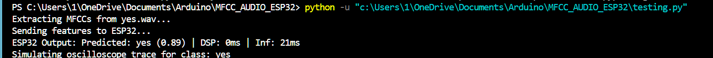
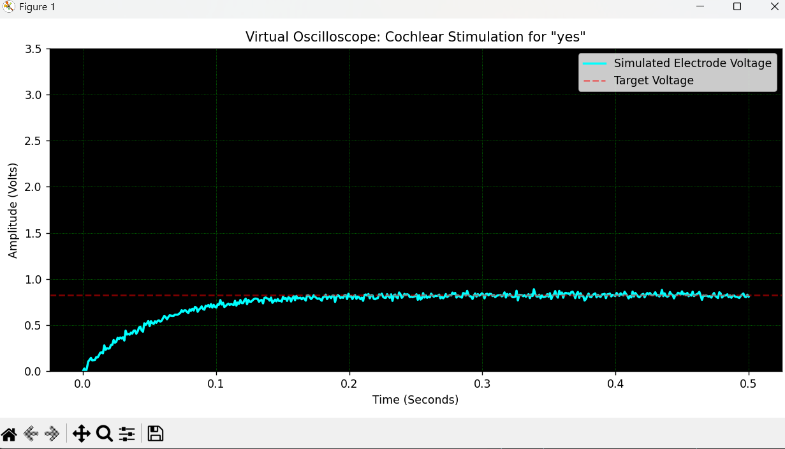

# MFCC_AUDIO_ESP32
Cochlear implant with HIL worklow, sending PWM signals on specific word ouputs. ESP32 send the PWM signals in resposne to specific words it was trained on to mimic actual cochlear implant workflows where we cant send the word we think the audio signal matches but have to send analog signals instead. Python is used to calculate the MFCC response of a particular .wav file and send's the MFCC as 416 floats ( total bytes = 416*4), then the ESP32 predicts the most probable word and send the word as an output. The python file then calculates the max(final) volatge the output signal (if it had been sent by an ESP32 with an RC filter) and plots the values the voltage the signal would take against time taken (on x axis).This plt gets shown by matplotlib. This output matches the output which would have been seen by sending the output to  a real RC filter and  measuring the output via an oscilloscope.

